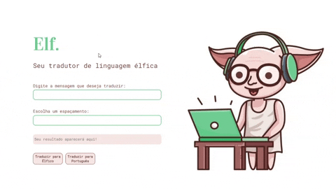
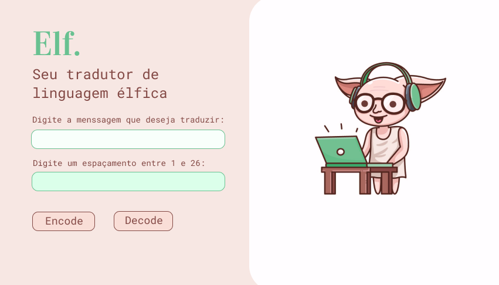

# Elf :herb:

## Table of Contents

* [Table of Contents](#table-of-contents)
* [About the Project](#about-the-project)
* [Project Prototype](#project-prototype)
* [Getting Started](#getting-started)
* [How to Contribute](#how-to-contribute)

## About the Project

Cifrar significa codificar. A [cifra de
César](https://pt.wikipedia.org/wiki/Cifra_de_C%C3%A9sar) é um dos primeiros
tipos de criptografias conhecidas na história. O imperador romano Júlio César
utilizava essa cifra para enviar ordens secretas aos seus generais no campo de
batalha.

___Este projeto é um "tradutor de linguagem élfica" que foi criado ultilizando a Cifra de César___

E se você encontrasse um elfo e não pudesse se comunicar com ele? Que terrível seria! :scream:
Foi pensando nisso que o Elf foi criado, um tradutor de linguagem élfica para pessoas que acreditam que elfos existem e principalmente que podemos nos comunicar com eles!

### Build With
* [JavaScript](https://developer.mozilla.org/pt-BR/docs/Web/JavaScript)
* [CSS](https://developer.mozilla.org/pt-BR/docs/Web/CSS)
* [HTML](https://developer.mozilla.org/pt-BR/docs/Web/HTML)

## Project prototype

>Protótipo inical do projeto criado ultilizando [Figma](https://www.figma.com/file/Dqh6nMAi1PoOzBRbhYvywL/Caesar-Cipher?node-id=0%3A1). 
_Houveram algumas decisões de mudança de layout durante o processo de densenvolvimento do projeto, o resultado final acabou ficando um pouco diferente do protótipo._

## Getting Started

### Requirements

* npm
`npm install npm@latest -g`

### Installation

* Clone the repo 
`git clone https://github.com/Nijoane/Elf-translator.git`

 

* Install NPM packages 
`npm install`

## How to Contribute

1. Fork the Project
2. Create your Feature Branch`(git checkout -b feature/YourFeature)`
3. Commit your Changes`(git commit -m "add your feature")`
4. Push on the Branch `(git push origin feature/YourFeature )`
5. Open a Pull Request

___
__Thank YOU!__ :smile:
